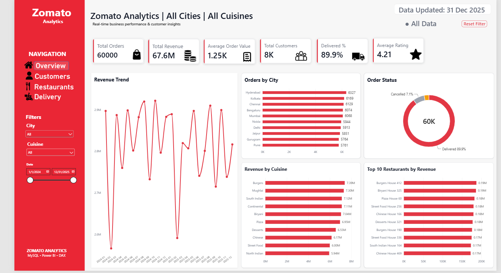
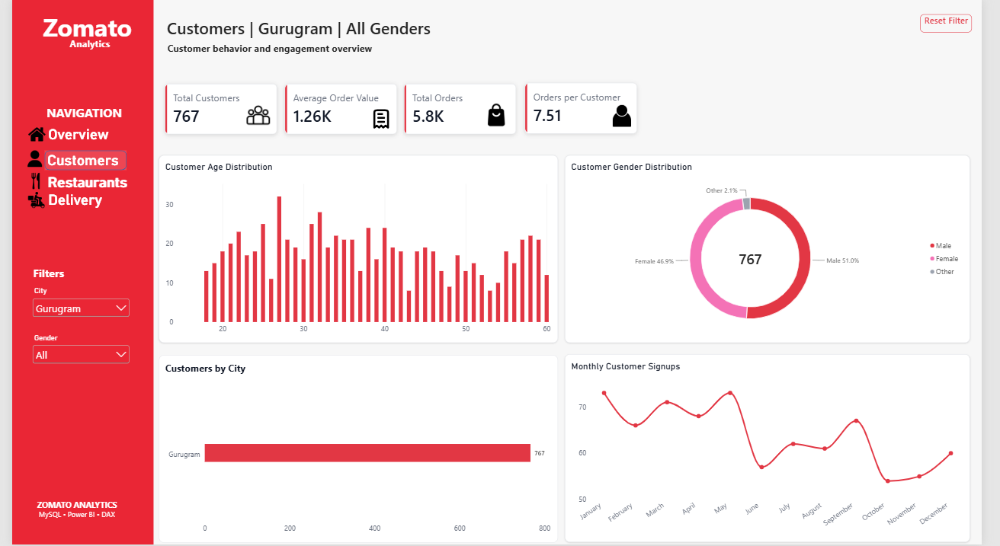
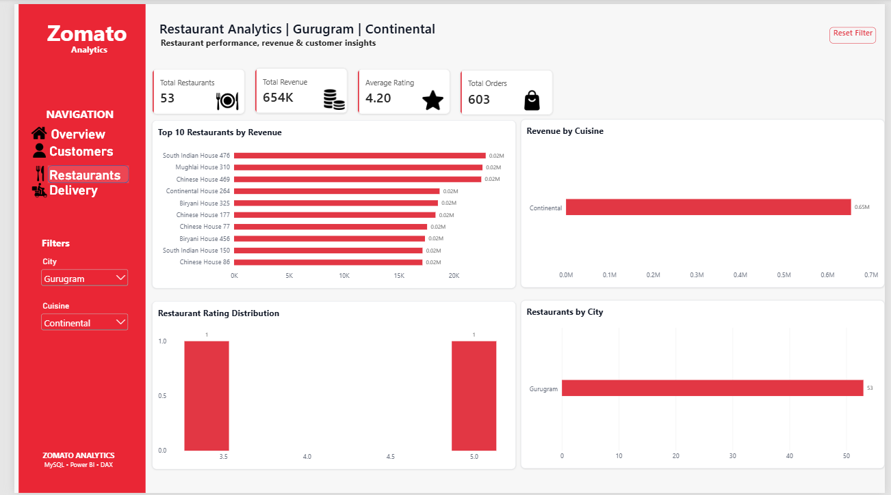
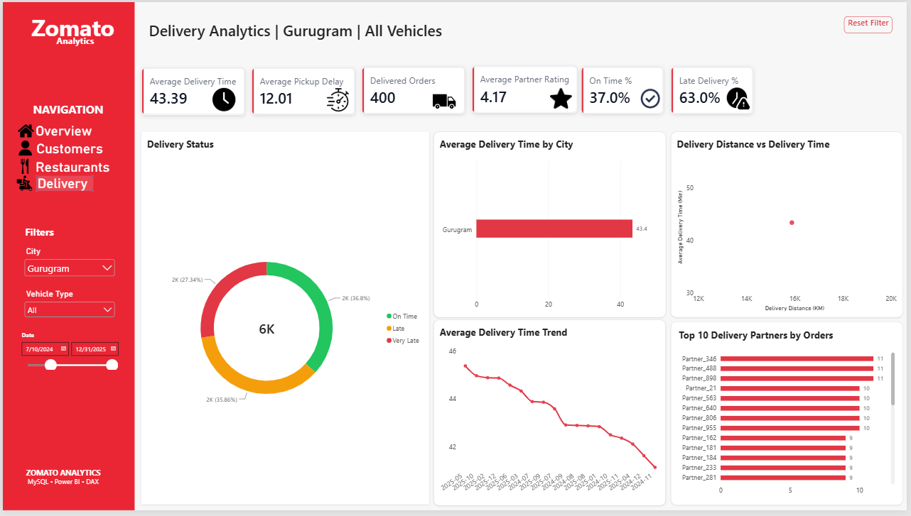

# Zomato-Inspired Food Delivery Analytics Dashboard

An end-to-end data analytics project built using **MySQL, Power BI, Power Query, and DAX**.

The goal of this project was to work with a realistic food-delivery business scenario and turn relational data into an interactive dashboard that can be used to explore orders, revenue, customers, restaurants, and delivery performance.

> **Note:** This is an independent portfolio project created for learning and demonstration purposes. The dataset is synthetic and is not official Zomato data.
## Dashboard Preview

### Customers Dashboard

### Restaurants Dashboard

### Delivery Dashboard

## Project Overview

The project uses a synthetic dataset containing **60,000 orders** along with customer, restaurant, payment, delivery, review, food-item, and delivery-partner data.

The data was organized in MySQL and then connected to Power BI, where I performed data transformation, modeling, DAX calculations, and dashboard development.

The final report contains four main analytical pages:

- **Overview** – overall business performance and key KPIs
- **Customers** – customer behaviour, demographics, and engagement
- **Restaurants** – restaurant performance, revenue, ratings, and cuisine analysis
- **Delivery** – delivery performance, partner analysis, delays, and delivery times

## Key Dashboard Features

This project goes beyond static charts and includes several interactive Power BI features:

- Custom page navigation
- Synced slicers across report pages
- Dynamic page titles
- Reset Filter buttons using bookmarks
- Report page tooltips
- Restaurant-level drill-through analysis
- Delivery-partner drill-through analysis
- Custom back navigation
- Interactive KPI cards
- Dynamic filter-status indicator
- Date, city, cuisine, gender, and vehicle-type filtering

## Key Metrics

Some of the KPIs analyzed in the dashboard include:

- Total Orders
- Total Revenue
- Average Order Value
- Total Customers
- Delivery Rate
- Average Customer Rating
- Orders per Customer
- Total Restaurants
- Average Delivery Time
- Average Pickup Delay
- On-Time Delivery %
- Late Delivery %
- Delivery Partner Rating

## Data Model

The project uses multiple related tables, including:

- Customers
- Orders
- Order Items
- Restaurants
- Food Items
- Payments
- Deliveries
- Delivery Partners
- Reviews
- Date Dimension
- City Dimension

Relationships and filter directions were designed to support cross-page analysis while avoiding ambiguous filter paths.
## SQL Analysis

The SQL part of this project includes business-focused queries written in MySQL to analyze the underlying food-delivery data.

The analysis covers:

- Overall orders, customers, restaurants, and revenue
- Top 10 restaurants by revenue
- Revenue and order analysis by cuisine
- Monthly revenue and order trends
- Top 3 restaurants in each city using ranking

SQL concepts used include **JOINs, GROUP BY, aggregate functions, date functions, CTEs, and window functions such as DENSE_RANK()**.

The complete SQL analysis is available in:

`zomato_analytics_queries.sql`
## Tools & Technologies

- **MySQL** – data storage and SQL analysis
- **Power BI** – dashboard development and visualization
- **Power Query** – data cleaning and transformation
- **DAX** – measures and interactive calculations
- **Data Modeling** – table relationships and dimensional modeling

## Dataset

The dataset used in this project is **synthetically generated** for portfolio and learning purposes.

Main dataset size:

- 60,000 Orders
- 8,000 Customers
- 500 Restaurants
- 1,200 Food Items
- 1,000 Delivery Partners
- 115,000+ Order Item records
- 38,000+ Reviews

## What I Learned

This project helped me strengthen my understanding of the complete analytics workflow — from working with relational data in MySQL to building a structured data model and creating an interactive Power BI report.

A major focus was not just creating charts, but designing a dashboard where users can navigate between different business areas, apply filters, view contextual tooltips, and drill into individual restaurants and delivery partners.

## Dashboard File

The complete Power BI report is available in this repository:

`Zomato_Analytics_Dashboard.pbix`

---

### Feedback

I'm continuously improving my data analytics skills, so feedback and suggestions on the project are welcome.
